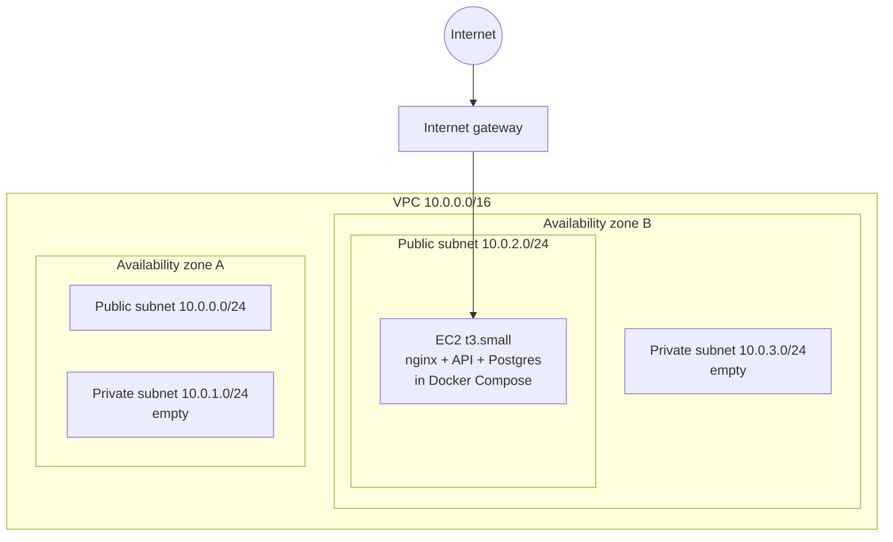
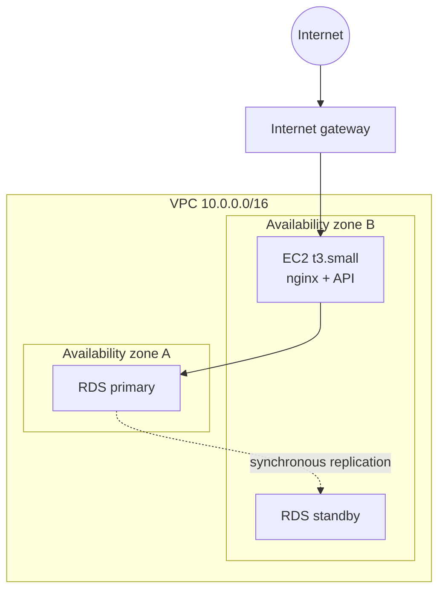
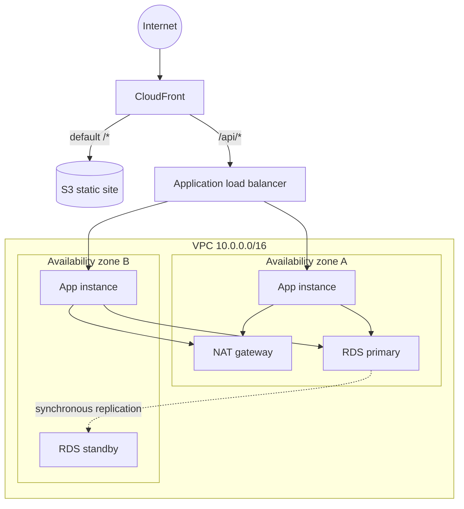

# Operations Portal

A mini ERP and CRM portal for a wholesale distribution business. Internal staff manage customers
and follow ups, maintain the product catalogue and stock, and raise sales challans that move stock
out of the warehouse.

## Live environment

| | |
| --- | --- |
| Portal | https://3-110-38-242.nip.io |
| API | https://3-110-38-242.nip.io/api |
| Health check | https://3-110-38-242.nip.io/api/health |
| Region | ap-south-1, single EC2 instance behind nginx, Let's Encrypt certificate |

Sign in with any account from [Test accounts](#test-accounts); all use the password `Portal@2026`.

## Contents

- [Live environment](#live-environment)
- [Stack](#stack)
- [Architecture](#architecture)
- [Modules](#modules)
- [Running locally](#running-locally)
- [Environment variables](#environment-variables)
- [Test accounts](#test-accounts)
- [API reference](#api-reference)
- [Roles and permissions](#roles-and-permissions)
- [Deployment](#deployment)
- [Assumptions](#assumptions)
- [Known limitations](#known-limitations)

## Stack

| Layer | Choice |
| --- | --- |
| Backend | Node.js 22, TypeScript, Express 5 |
| Database | PostgreSQL 17 with Prisma 6 |
| Validation | Zod |
| Auth | JWT bearer tokens, bcrypt password hashing |
| Frontend | React 19, Vite, React Router, hand written CSS |
| Documents | PDFKit for challan PDFs |
| Object storage | Amazon S3 with presigned read URLs |
| Infrastructure | Terraform, Docker, Amazon EC2, RDS, ALB, CloudFront |
| CI/CD | GitHub Actions with OIDC, no stored AWS keys |

## Architecture

The API is a stateless Express service. Every request is validated at the edge of the controller
with a Zod schema, handled by a service that owns the business rules, and persisted through Prisma.
A single error handler converts Zod failures, domain errors and Prisma errors into one response
shape, so the frontend has exactly one thing to parse.

```
frontend (React)  ->  /api  ->  Express router
                                  |
                                  +-- middleware: authenticate, authorize
                                  +-- controller: parse request with Zod
                                  +-- service:    business rules, Prisma transactions
                                  +-- errorHandler: one response shape for every failure
```

The infrastructure is deliberately built in three stages so the growth path is visible rather than
assumed. A single `stage` variable in Terraform moves between them.

### Stage 1, single server



No NAT gateway exists yet, because nothing runs in a private subnet. That decision alone keeps
about 32 USD a month off the bill until it is actually needed.

### Stage 2, managed database



Postgres moves out of the container and into RDS Multi-AZ across both private subnets. The database
security group accepts port 5432 from the application security group only.

### Stage 3, load balanced and auto scaled



The application instances move into the private subnets behind an Auto Scaling group. They accept
traffic on port 4000 from the load balancer security group and from nowhere else. There is no SSH
ingress anywhere in the VPC; shell access is through SSM Session Manager. CloudFront sits in front
with two behaviours, so the site and the API share one origin and one free TLS certificate.

## Modules

**Authentication and roles.** JWT login for four roles: admin, sales, warehouse and accounts.
Passwords are bcrypt hashed. Login is rate limited.

**Customer CRM.** Name, mobile, email, business name, optional GST number, customer type, full
address, status, follow up date and notes. Search across name, business, mobile, email and GST,
filter by status and type, and a dated follow up note trail on the detail page.

**Products and inventory.** Name, SKU, category, unit price, current stock, minimum stock alert
level and warehouse location. Stock is never edited directly on the product form. Every change goes
through a stock movement recording the product, quantity, direction, reason, author and timestamp,
so the movement log is the authoritative history.

**Sales challans.** Select a customer, add product lines, and save as draft or confirmed. Challan
numbers are generated automatically from a sequence table. Confirming reduces stock; cancelling a
confirmed challan returns it.

### Why challan lines are snapshots

`ChallanItem` stores `productName`, `productSku` and `unitPrice` alongside the product id. A challan
is a document that was handed to a customer on a particular day. If a product is later renamed or
repriced, the historical challan and its PDF must still show what was actually delivered and
charged. Keeping only a foreign key would silently rewrite history.

### How stock is protected

Confirming a challan runs inside one transaction. Each line is decremented with a conditional
update:

```sql
UPDATE products SET current_stock = current_stock - $qty
WHERE id = $id AND current_stock >= $qty
```

If that affects zero rows the stock was insufficient, and the whole transaction is rolled back with
a 400 naming the SKU, the available quantity and the required quantity. The condition lives in the
`WHERE` clause rather than in application code, so two users confirming at the same moment cannot
both pass a check and drive stock negative. A read-then-write check would race.

## Running locally

The whole stack runs in Docker, so nothing beyond Docker needs installing.

```bash
cp .env.example .env
docker compose up -d --build
docker compose exec api npx prisma migrate deploy
docker compose exec api node dist/seed.js
```

The portal is then on `http://localhost` and the API on `http://localhost/api`.

To run the two applications directly instead, you need a PostgreSQL instance and Node.js 22:

```bash
cd backend
cp .env.example .env
npm install
npx prisma migrate deploy
npm run seed
npm run dev
```

```bash
cd frontend
npm install
npm run dev
```

The Vite dev server proxies `/api` to `http://localhost:4000`, so no CORS configuration is needed
during development.

## Environment variables

Nothing secret is committed. `.env.example` at the repository root documents every variable the
compose stack reads, and `backend/.env.example` documents the API on its own.

| Variable | Purpose |
| --- | --- |
| `DATABASE_URL` | PostgreSQL connection string |
| `JWT_SECRET` | Signing key for access tokens |
| `JWT_EXPIRES_IN` | Token lifetime, defaults to 8h |
| `PORT` | API port, defaults to 4000 |
| `CORS_ORIGIN` | Allowed origin, or `*` |
| `AWS_REGION` | Region used for S3 |
| `S3_IMAGE_BUCKET` | Product image bucket, image upload is disabled when empty |
| `COMPANY_NAME`, `COMPANY_ADDRESS`, `COMPANY_GST` | Printed on the challan PDF |

In AWS none of these are written to disk on the instance. They live in SSM Parameter Store as
SecureString values, and the instance reads them at boot using its IAM role. There are no AWS access
keys on the server and none in GitHub, which authenticates to AWS through OIDC.

## Test accounts

Every account uses the password `Portal@2026`.

| Email | Role |
| --- | --- |
| `admin@example.com` | Admin |
| `sales@example.com` | Sales |
| `warehouse@example.com` | Warehouse |
| `accounts@example.com` | Accounts |

## API reference

Base path `/api`. All routes except login and the health checks require
`Authorization: Bearer <token>`. List endpoints accept `page` and `limit` and return
`{ data, meta }` where meta carries `total`, `page`, `limit` and `totalPages`.

| Method | Path | Purpose |
| --- | --- | --- |
| GET | `/health` | Liveness, used by the load balancer |
| GET | `/health/ready` | Readiness, checks the database |
| POST | `/auth/login` | Exchange credentials for a token |
| GET | `/auth/me` | Current user |
| GET | `/customers` | List, filter by `search`, `status`, `type` |
| POST | `/customers` | Create |
| GET | `/customers/:id` | Detail with follow ups and recent challans |
| PATCH | `/customers/:id` | Update |
| GET | `/customers/:id/notes` | Follow up history |
| POST | `/customers/:id/notes` | Add a follow up note |
| GET | `/products` | List, filter by `search`, `category`, `lowStock` |
| POST | `/products` | Create, opening stock writes an inward movement |
| GET | `/products/categories` | Distinct categories |
| GET | `/products/:id` | Detail |
| PATCH | `/products/:id` | Update, cannot change stock |
| POST | `/products/:id/stock` | Record a stock movement |
| POST | `/products/:id/image` | Upload an image to S3 |
| GET | `/stock-movements` | Movement log, filter by `productId`, `type` |
| GET | `/challans` | List, filter by `search`, `status`, `customerId` |
| POST | `/challans` | Create as draft or confirmed |
| GET | `/challans/:id` | Detail with snapshot line items |
| POST | `/challans/:id/confirm` | Confirm and reduce stock |
| POST | `/challans/:id/cancel` | Cancel and return stock if it was confirmed |
| GET | `/challans/:id/pdf` | Download the challan as a PDF |
| GET | `/dashboard/summary` | Counts, stock alerts and due follow ups |

Errors always look the same:

```json
{
  "error": {
    "message": "Validation failed",
    "details": [{ "field": "mobile", "message": "Enter a valid 10 digit mobile number" }]
  }
}
```

Status codes in use: 200, 201, 400 validation or business rule, 401 missing or bad token,
403 role not permitted, 404 not found, 409 conflicting state, 500 unexpected.

A Postman collection covering every endpoint, including the deliberate failure cases, is in
[`postman/operations-portal.postman_collection.json`](postman/operations-portal.postman_collection.json).
Run **Auth / Login** first; it stores the token for every other request.

## Roles and permissions

| Action | Admin | Sales | Warehouse | Accounts |
| --- | :---: | :---: | :---: | :---: |
| Read everything | yes | yes | yes | yes |
| Create and edit customers | yes | yes | | |
| Add follow up notes | yes | yes | | |
| Create and edit products | yes | | yes | |
| Record stock movements | yes | | yes | |
| Create and cancel challans | yes | yes | | |
| Confirm challans | yes | yes | yes | |
| Download challan PDF | yes | yes | | yes |

## Deployment

Infrastructure is Terraform in [`infra/`](infra), deployed to `ap-south-1`. Full runbook,
including TLS, stage transitions and the teardown checklist, is in [DEPLOYMENT.md](DEPLOYMENT.md).

## Assumptions

- The business operates in India, so mobile numbers are validated as ten digits starting 6 to 9,
  pincodes as six digits, and GST numbers against the standard fifteen character GSTIN format.
- Challan numbers run `CH-YYYY-NNNN` on the calendar year. A real deployment would likely want the
  Indian financial year instead; the sequence table already keys on year so that is a small change.
- Prices are stored as `numeric(12,2)` and returned as JSON numbers. Values in this domain stay far
  inside the range where that is exact.
- A challan is a delivery document, so confirming it is what moves stock. Purchase orders and
  accounting invoices are named in the brief's background but are not part of the required modules,
  so they are not built.
- Cancelling a confirmed challan returns stock rather than blocking, which matches how a physical
  delivery that was refused or returned is handled.

## Known limitations

- No automated test suite. The Postman collection covers the API paths, including the failure cases,
  but there are no unit or integration tests.
- Tokens do not refresh. A token lasts eight hours and the user signs in again after that.
- The challan form loads up to one hundred customers and products into select lists rather than
  paging or searching within them. Fine at this data volume, not at ten thousand products.
- Stage 3 runs one NAT gateway rather than one per availability zone. This is a deliberate cost
  trade off and it means an AZ A failure would cut outbound internet for instances in AZ B. Inbound
  traffic and the database would still fail over correctly.
- Product images are soft deleted only in the sense that replacing an image leaves the previous
  object in the bucket. Bucket versioning is on, so nothing is lost, but nothing is reaped either.
