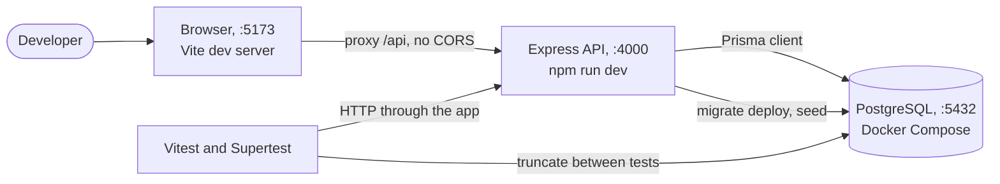
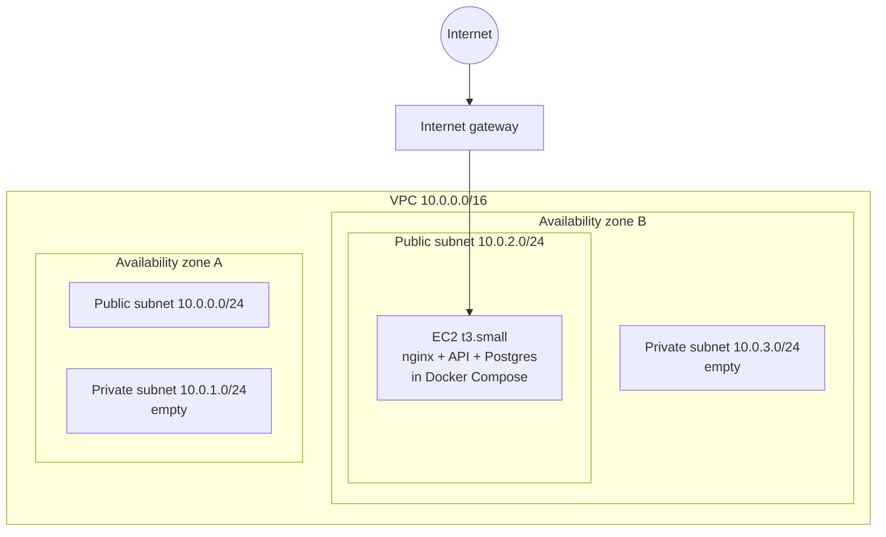
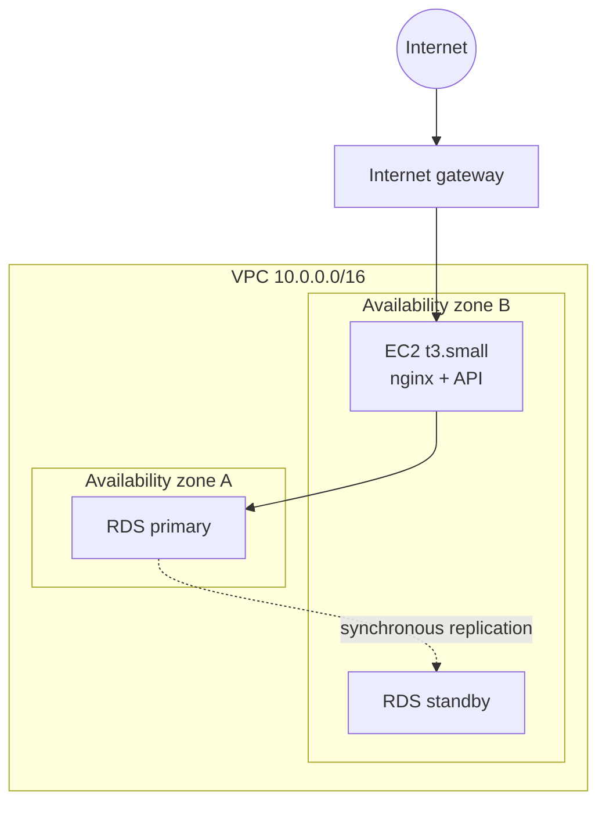
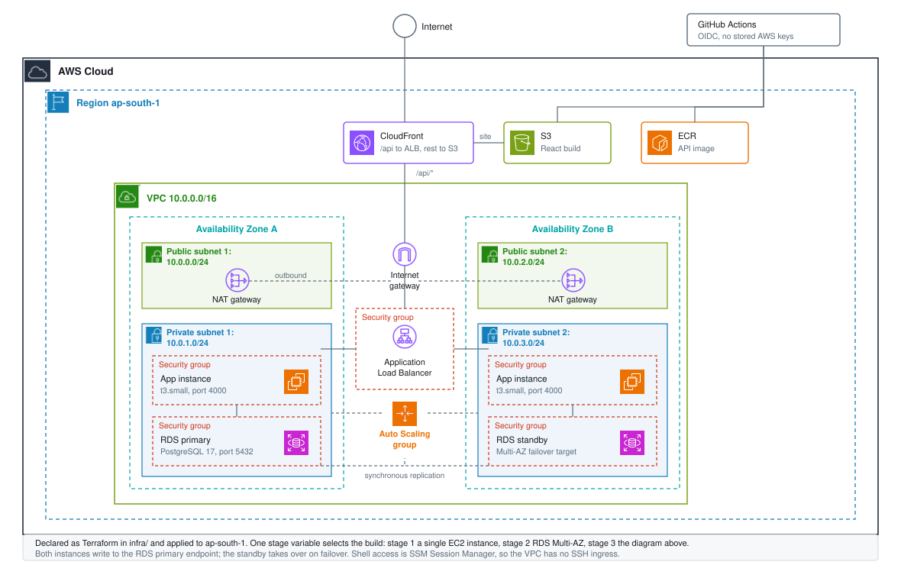

# Operations Portal

A mini ERP and CRM portal for a wholesale distribution business. Internal staff manage customers
and follow ups, maintain the product catalogue and stock, and raise sales challans that move stock
out of the warehouse.

## Live environment

| | |
| --- | --- |
| Portal | https://erp-portal-web.onrender.com |
| API | https://erp-portal-api.onrender.com/api |
| Hosting | Render static site and web service, defined in [`render.yaml`](render.yaml) |
| Database | Supabase PostgreSQL 17, application tables in the `erp_portal` schema |

Sign in with any account from [Test accounts](#test-accounts); all use the password `Portal@2026`.

The API runs on Render's free instance type, which sleeps after about fifteen minutes without
traffic. The first request after a sleep wakes it and can take up to a minute; every request after
that is normal. Load the portal once and give it a moment before judging it.

### The AWS build is also included

Render is what is live. The repository also carries a full Terraform build for AWS in
[`infra/`](infra), raised with `./scripts/up.sh 3` and destroyed between demonstrations, so no AWS
URL is quoted here. Both resilience claims were measured, not assumed:

| Test | Command | Result |
| --- | --- | --- |
| Database failover | `reboot-db-instance --force-failover` | primary moved `ap-south-1b` to `ap-south-1a`, API recovered on its own in about 25s, no restart |
| Instance loss | hard terminate an ASG instance | one failed request, replacement launched, both targets healthy again in about 2m30s |

## Contents

- [Live environment](#live-environment)
- [Stack](#stack)
- [Architecture](#architecture)
- [Modules](#modules)
- [Running locally](#running-locally)
- [Environment variables](#environment-variables)
- [Test accounts](#test-accounts)
- [Testing](#testing)
- [API reference](#api-reference)
- [Roles and permissions](#roles-and-permissions)
- [Deployment](#deployment)
- [Assumptions](#assumptions)
- [Known limitations](#known-limitations)

## Stack

| Layer | Choice |
| --- | --- |
| Backend | Node.js 22, TypeScript, Express 5 |
| Database | PostgreSQL 17 with Prisma 6 |
| Validation | Zod |
| Auth | JWT bearer tokens, bcrypt password hashing |
| Frontend | React 19, Vite, React Router, hand written CSS |
| Documents | PDFKit for challan PDFs |
| Object storage | Amazon S3 with presigned read URLs |
| Shared state | Redis, optional, holds the login rate limit across instances |
| Infrastructure | Terraform, Docker, Amazon EC2, RDS, RDS Proxy, ElastiCache, ALB, CloudFront |
| CI/CD | GitHub Actions with OIDC, no stored AWS keys |

## Architecture

The API is a stateless Express service. Every request is validated at the edge of the controller
with a Zod schema, handled by a service that owns the business rules, and persisted through Prisma.
A single error handler converts Zod failures, domain errors and Prisma errors into one response
shape, so the frontend has exactly one thing to parse.

```
frontend (React)  ->  /api  ->  Express router
                                  |
                                  +-- middleware: authenticate, authorize
                                  +-- controller: parse request with Zod
                                  +-- service:    business rules, Prisma transactions
                                  +-- errorHandler: one response shape for every failure
```

The infrastructure is deliberately built in three stages so the growth path is visible rather than
assumed. A single `stage` variable in Terraform moves between them.

### Stage 0, the development loop

Before any of it is on AWS, this is how the pieces talk on one machine.



### Stage 1, single server



No NAT gateway exists yet, because nothing runs in a private subnet. That decision alone keeps
about 32 USD a month off the bill until it is actually needed.

### Stage 2, managed database



Postgres moves out of the container and into RDS Multi-AZ across both private subnets. The database
security group accepts port 5432 from the application security group only.

### Stage 3, load balanced and auto scaled



| Decision | Detail |
| --- | --- |
| Compute | Auto Scaling group of `t3.small`, one per private subnet, API on port 4000 |
| Ingress | ALB in the public subnets, security group allows 4000 to the app group only |
| Database | RDS PostgreSQL 17 Multi-AZ, 5432 from the app security group only |
| Pooling | RDS Proxy in front of the database, so instances share one pooled set of connections instead of each opening its own |
| Shared state | ElastiCache Redis, two nodes with automatic failover, holds the login rate limit, reachable from the app security group only |
| Egress | One NAT gateway per zone, each private subnet routing through its own |
| Edge | One CloudFront distribution, `default /*` to S3 and `/api/*` to the ALB |
| Shell access | SSM Session Manager, no SSH ingress anywhere in the VPC |
| Deploys | GitHub Actions over OIDC, image to ECR and build to S3, no stored AWS keys |

### What Redis is used for, and what it is not

Running more than one instance breaks something that looks fine on a single box: the login rate
limiter kept its counters in process, so two instances allowed twice the attempts and four allowed
four times. Redis holds those counters instead, so the limit is the limit no matter how many
instances are running. That is the whole job.

**Nothing else is cached, and both omissions are deliberate.**

The dashboard is not cached. This is an internal portal for a few dozen staff, so those aggregates
are read a few hundred times a day; caching them would buy milliseconds and cost invalidation bugs.

The account lookup is not cached either, and that one was tried and removed. `authenticate` reloads
the account behind the token on every request, which makes it the most repeated query here and an
obvious cache candidate. It also underwrites a guarantee: deactivating a user ends their session
immediately, and a role change applies on their very next request. A cache with any TTL weakens
that, and only invalidating writes made through this API would still miss a change made directly in
the database. The guarantee is worth more than the milliseconds, so the query stays.

Redis is optional. With `REDIS_URL` unset the limiter counts per process, which is how the free tier
deployment runs. If Redis is configured but unreachable the limiter fails open and logs once rather
than answering 500.

## Modules

| Module | Screens | Enforced rules |
| --- | --- | --- |
| Auth | Login | bcrypt hashes, rate limited login, no public sign up, token revalidated against the live account on every request |
| Users | Staff list, create, edit, reset password | admin only; an admin cannot demote or deactivate themselves |
| Customers | List, detail, follow up queue | `mobile` is unique and a duplicate answers 409; notes are dated and append only |
| Products | Catalogue, stock movement log | stock is read only on the product form; every change writes a movement row |
| Challans | List, builder, PDF | confirm deducts stock, cancel returns it, numbers come from a sequence table |

### Data model

| Model | Key columns | Notes |
| --- | --- | --- |
| `User` | `email @unique`, `passwordHash`, `role`, `isActive` | `Role` is ADMIN, SALES, WAREHOUSE, ACCOUNTS |
| `Customer` | `mobile @unique`, `businessName`, `gstNumber?`, `type`, `status`, `followUpDate?` | `CustomerType` RETAIL, WHOLESALE, DISTRIBUTOR; `CustomerStatus` LEAD, ACTIVE, INACTIVE |
| `CustomerNote` | `customerId`, `note`, `followUpDate?`, `createdById` | the dated follow up trail |
| `Product` | `sku @unique`, `unitPrice numeric(12,2)`, `currentStock`, `minStockAlert`, `location` | `imageKey` is null when S3 is not configured |
| `StockMovement` | `productId`, `type IN\|OUT`, `quantity`, `reason`, `createdById`, `referenceId?` | the authoritative stock history |
| `Challan` | `challanNumber @unique`, `status`, `totalQuantity`, `totalAmount numeric(12,2)` | `ChallanStatus` DRAFT, CONFIRMED, CANCELLED |
| `ChallanItem` | `productId`, `productName`, `productSku`, `unitPrice`, `quantity`, `lineTotal` | name, SKU and price are snapshots, not lookups |
| `DocumentSequence` | `@@id([docType, year])`, `lastNumber` | issues `CH-YYYY-NNNN` |

### Challan lines are snapshots

```prisma
model ChallanItem {
  productId   String
  productName String
  productSku  String
  unitPrice   Decimal @db.Decimal(12, 2)
}
```

A rename or a reprice must not rewrite a challan already handed to a customer, so the document
stores what was delivered and charged rather than looking it up again.

### Oversell is stopped in SQL, not in application code

```sql
UPDATE products SET current_stock = current_stock - $qty
WHERE id = $id AND current_stock >= $qty
```

Zero rows affected means the stock was insufficient, and the whole transaction rolls back with a
400 naming the SKU, the available quantity and the required quantity. The condition sits in the
`WHERE`, so two users confirming at the same moment cannot both pass a read-then-write check.

## Running locally

The whole stack runs in Docker, so nothing beyond Docker needs installing.

```bash
cp .env.example .env
docker compose up -d --build
docker compose exec api npx prisma migrate deploy
docker compose exec api node dist/seed.js
```

The portal is then on `http://localhost` and the API on `http://localhost/api`.

To run the two applications directly instead, you need a PostgreSQL instance and Node.js 22:

```bash
cd backend
cp .env.example .env
npm install
npx prisma migrate deploy
npm run seed
npm run dev
```

```bash
cd frontend
npm install
npm run dev
```

The Vite dev server proxies `/api` to `http://localhost:4000`, so no CORS configuration is needed
during development.

## Environment variables

Nothing secret is committed. `.env.example` at the repository root documents every variable the
compose stack reads, and `backend/.env.example` documents the API on its own.

| Variable | Purpose |
| --- | --- |
| `DATABASE_URL` | PostgreSQL connection string |
| `JWT_SECRET` | Signing key for access tokens |
| `JWT_EXPIRES_IN` | Token lifetime, defaults to 8h |
| `PORT` | API port, defaults to 4000 |
| `CORS_ORIGIN` | Allowed origin, or `*` |
| `AWS_REGION` | Region used for S3 |
| `S3_IMAGE_BUCKET` | Product image bucket, image upload is disabled when empty |
| `COMPANY_NAME`, `COMPANY_ADDRESS`, `COMPANY_GST` | Printed on the challan PDF |

In AWS none of these are written to disk on the instance. They live in SSM Parameter Store as
SecureString values, and the instance reads them at boot using its IAM role. There are no AWS access
keys on the server and none in GitHub, which authenticates to AWS through OIDC.

## Test accounts

Every account uses the password `Portal@2026`.

| Email | Role |
| --- | --- |
| `admin@example.com` | Admin |
| `sales@example.com` | Sales |
| `warehouse@example.com` | Warehouse |
| `accounts@example.com` | Accounts |

## Testing

Vitest drives the Express app through Supertest against a real PostgreSQL database. There are no
mocks for Prisma, because the behaviour worth proving here is transactional: stock deduction,
rollback on oversell, and the role matrix. A mocked client would prove none of it.

```bash
cd backend
cp .env.test.example .env.test    # point DATABASE_URL at a throwaway database
npm test
```

The runner applies the migrations once before the suite, then truncates every table between tests,
so each test starts from an empty schema. Test files run one at a time against the single database.
`npm run test:coverage` writes a text and lcov report.

The database is disposable and every table is truncated, so never point `DATABASE_URL` at an
environment that holds data you want to keep.

| File | Covers |
| --- | --- |
| `tests/auth.test.ts` | Login, deactivated accounts, token rejection, profile |
| `tests/users.test.ts` | Staff creation, deactivation locking a live session out, password reset |
| `tests/rbac.test.ts` | Every route against all four roles, plus the GST masking on challans |
| `tests/challans.test.ts` | Stock deduction, oversell rollback, cancellation, numbering, PDF |
| `tests/products.test.ts` | Stock adjustments, movement history, filters, image guard |
| `tests/customers.test.ts` | Validation, unique mobile, partial updates, notes, follow up queue, search |
| `tests/dashboard.test.ts` | The per role payload, asserting absence as well as presence |
| `tests/health.test.ts` | Liveness, readiness, unknown route shape |

CI runs the same suite on every push and pull request against a `postgres:16` service container, so
it needs no local PostgreSQL.

## API reference

Base path `/api`. All routes except login and the health checks require
`Authorization: Bearer <token>`. List endpoints accept `page` and `limit` and return
`{ data, meta }` where meta carries `total`, `page`, `limit` and `totalPages`.

### Postman

[`postman/operations-portal.postman_collection.json`](postman/operations-portal.postman_collection.json)
covers all thirty nine endpoints. Import it and send **Auth → Login**: the response test stores the
token on the collection, and every other request inherits it as bearer auth, so nothing has to be
pasted by hand. The `baseUrl` variable points at the live API; change it to
`http://localhost:4000/api` to run the same collection against a local server.

| Method | Path | Purpose |
| --- | --- | --- |
| GET | `/health` | Liveness, used by the load balancer |
| GET | `/health/ready` | Readiness, checks the database |
| POST | `/auth/login` | Exchange credentials for a token |
| GET | `/auth/me` | Current user |
| GET | `/users` | Admin only. List, filter by `search`, `role`, `isActive` |
| POST | `/users` | Admin only. Create a staff account |
| PATCH | `/users/:id` | Admin only. Name, role, activate or deactivate |
| POST | `/users/:id/password` | Admin only. Set a new password |
| GET | `/customers` | List, filter by `search`, `status`, `type` |
| GET | `/customers/follow-ups` | Due follow up queue, filter by `bucket` |
| POST | `/customers` | Create |
| GET | `/customers/:id` | Detail with follow ups and recent challans |
| PATCH | `/customers/:id` | Update |
| GET | `/customers/:id/notes` | Follow up history |
| POST | `/customers/:id/notes` | Add a follow up note |
| GET | `/products` | List, filter by `search`, `category`, `lowStock` |
| POST | `/products` | Create, opening stock writes an inward movement |
| GET | `/products/categories` | Distinct categories |
| GET | `/products/:id` | Detail |
| PATCH | `/products/:id` | Update, cannot change stock |
| POST | `/products/:id/stock` | Record a stock movement |
| POST | `/products/:id/image` | Upload an image to S3 |
| GET | `/stock-movements` | Movement log, filter by `productId`, `type` |
| GET | `/challans` | List, filter by `search`, `status`, `customerId` |
| POST | `/challans` | Create as draft or confirmed |
| GET | `/challans/:id` | Detail with snapshot line items |
| POST | `/challans/:id/confirm` | Confirm and reduce stock |
| POST | `/challans/:id/cancel` | Cancel and return stock if it was confirmed |
| GET | `/challans/:id/pdf` | Download the challan as a PDF |
| GET | `/dashboard/summary` | Counts, stock alerts and due follow ups |

Errors always look the same:

```json
{
  "error": {
    "message": "Validation failed",
    "details": [{ "field": "mobile", "message": "Enter a valid 10 digit mobile number" }]
  }
}
```

Status codes in use: 200, 201, 400 validation or business rule, 401 missing or bad token,
403 role not permitted, 404 not found, 409 conflicting state, 500 unexpected.

A Postman collection covering every endpoint, including the deliberate failure cases, is in
[`postman/operations-portal.postman_collection.json`](postman/operations-portal.postman_collection.json).
Run **Auth / Login** first; it stores the token for every other request.

## Roles and permissions

Enforced in the API, not the interface. The navigation hides what a role cannot use, but removing
that would change nothing: every route is guarded server side and answers 403.

**What each role can read.**

| Endpoint | Admin | Sales | Warehouse | Accounts |
| --- | :---: | :---: | :---: | :---: |
| `/users` | yes | | | |
| `/customers` and notes | yes | yes | | yes |
| `/products` | yes | yes | yes | yes |
| `/stock-movements` | yes | | yes | |
| `/challans` | yes | yes | yes | yes |
| `/dashboard/summary` | everything | no stock alerts | no customer figures or follow ups | no stock alerts |

The dashboard payload is assembled per role, so a warehouse token never receives customer counts or
follow up names at all. A warehouse copy of a challan carries the delivery address but not the GST
number.

**What each role can change.**

| Action | Admin | Sales | Warehouse | Accounts |
| --- | :---: | :---: | :---: | :---: |
| Manage staff accounts | yes | | | |
| Create and edit customers | yes | yes | | |
| Add follow up notes | yes | yes | | |
| View the follow up queue | yes | yes | | |
| Create and edit products | yes | | yes | |
| Record stock movements | yes | | yes | |
| Create and cancel challans | yes | yes | | |
| Confirm challans | yes | yes | yes | |
| Download challan PDF | yes | yes | | yes |

## Deployment

### Render and Supabase, the live deployment

[`render.yaml`](render.yaml) at the repository root declares both services, so the whole environment
is created from one blueprint rather than by filling in dashboard forms.

| Service | Type | Build | Start |
| --- | --- | --- | --- |
| `erp-portal-api` | Node web service | `npm install --include=dev && npm run build` | `npx prisma migrate deploy && npm start` |
| `erp-portal-web` | Static site | `npm install && npm run build`, published from `dist` | served by Render's CDN |

Migrations run on every start, so a deploy brings the schema forward on its own. Four values are
supplied in the dashboard rather than committed: `DATABASE_URL`, `JWT_SECRET`, `CORS_ORIGIN` and
`VITE_API_URL`. They are marked `sync: false` in the blueprint, which is what keeps secrets out of
the repository.

Two details worth knowing:

- The build installs dev dependencies explicitly. `NODE_ENV` is `production` on the service, which
  makes npm omit them, and the TypeScript compiler, the type packages and the Prisma CLI all live
  there.
- `npm install` is used rather than `npm ci`. The test tooling resolves two incompatible ranges for
  one transitive package, which `npm ci` refuses outright.

The database is Supabase. The application owns the `erp_portal` schema rather than `public`, set
with `?schema=erp_portal` on the connection string, so nothing collides with Supabase's own objects.
Use the session mode pooler on port 5432: the transaction pooler on 6543 cannot run migrations.

### AWS, the optional build

Infrastructure is Terraform in [`infra/`](infra), deployed to `ap-south-1`. Full runbook,
including TLS, stage transitions and the teardown checklist, is in [DEPLOYMENT.md](DEPLOYMENT.md).

## Assumptions

| Area | Assumption |
| --- | --- |
| Locale | Indian business, so mobiles validate as 10 digits starting 6 to 9, pincodes as 6 digits, GST against the 15 character GSTIN format |
| Numbering | `CH-YYYY-NNNN` on the calendar year; the sequence table keys on year, so the Indian financial year is a small change |
| Money | `numeric(12,2)`, returned as JSON numbers, which stays exact at this range |
| Scope | A challan is a delivery document, so confirming it moves stock. Purchase orders and accounting invoices are named in the brief's background but are not required modules |
| Returns | Cancelling a confirmed challan returns stock rather than blocking, matching a refused or returned delivery |

## Known limitations

| Limitation | Detail |
| --- | --- |
| Free tier sleep | The Render instance stops after about 15 minutes idle and the next request takes up to a minute. Gone on any paid instance or on AWS |
| Image upload | Inactive on the free deployment. `S3_IMAGE_BUCKET` is empty, so uploads are refused and the rest of the catalogue is unaffected |
| Frontend tests | API is covered end to end; React is verified by hand and by the typechecker only |
| Tokens | Eight hours, no refresh and no revocation list, so a password reset blocks the old password but not an open session |
| Proxy pinning | RDS Proxy multiplexes best on simple queries. Prisma uses prepared statements, which pin a session to a connection for its lifetime, so the proxy gives connection reuse and failover survival here rather than full multiplexing |
| Redis is best effort | If Redis is unreachable the login limiter fails **open**, allowing the request and logging once rather than answering 500. That is a deliberate availability choice on an internal portal; a public signup form would be a good argument for failing closed instead |
| Onboarding | Admin sets the password and tells the user; the portal sends no mail |
| Select lists | The challan form loads up to 100 customers and products rather than paging; fine at this volume, not at 10,000 products |
| NAT cost | Two NAT gateways, one per zone, so losing a zone does not cut outbound internet for the survivor. They are the largest hourly line item at roughly 0.11 USD an hour combined, which is why the stack is destroyed between demonstrations |
| Image reaping | Replacing an image leaves the old object. Bucket versioning is on, so nothing is lost and nothing is cleaned up |
| Deregistration | Hard terminating an instance costs a few requests, because the health check runs every 30s. A lifecycle hook would close that window |
| SPA routing | Handled by a CloudFront Function, not custom error responses, which would rewrite genuine API 403 and 404 replies into the index page |
