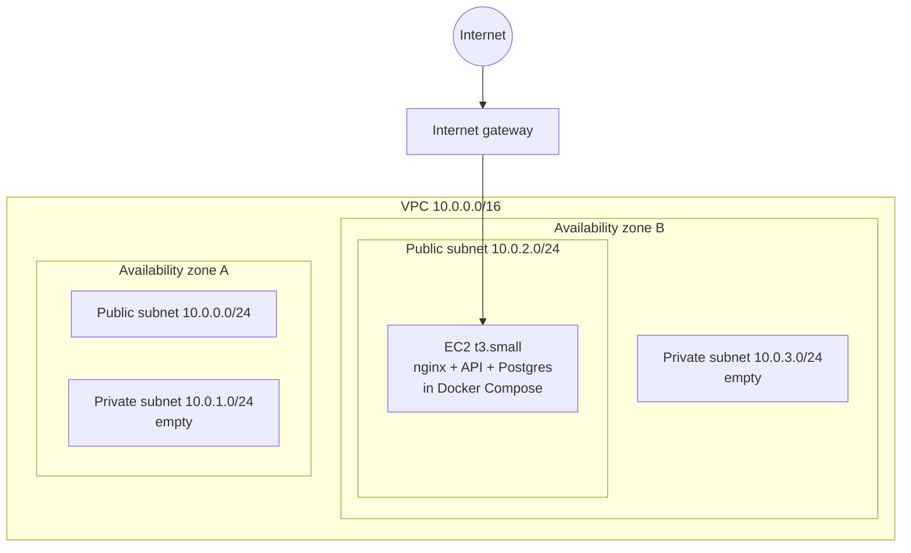
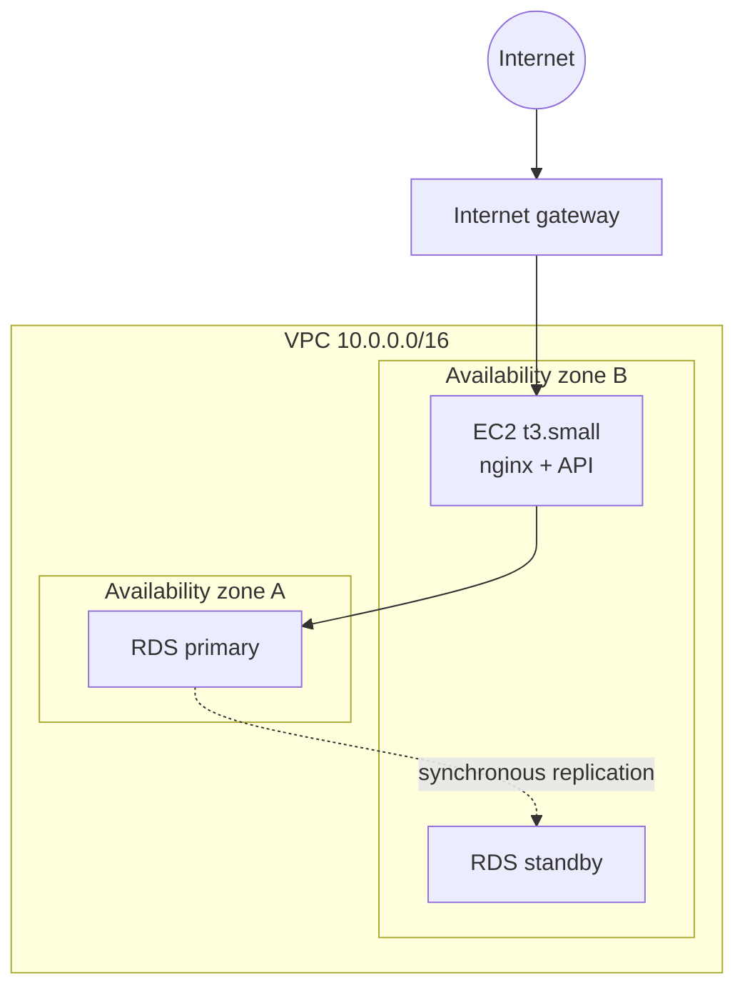
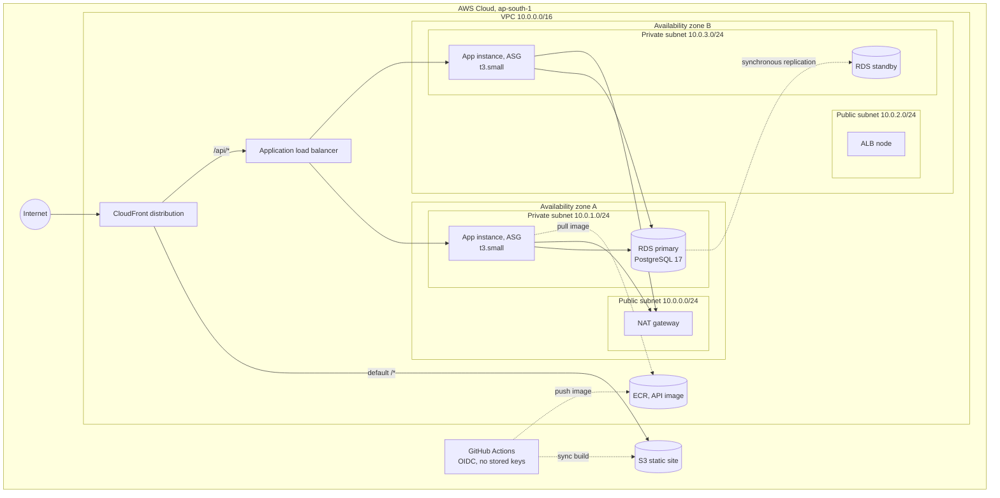

# Operations Portal

A mini ERP and CRM portal for a wholesale distribution business. Internal staff manage customers
and follow ups, maintain the product catalogue and stock, and raise sales challans that move stock
out of the warehouse.

## Live environment

| | |
| --- | --- |
| Portal | https://erp-portal-web.onrender.com |
| API | https://erp-portal-api.onrender.com/api |
| Hosting | Render static site and web service, defined in [`render.yaml`](render.yaml) |
| Database | Supabase PostgreSQL 17, application tables in the `erp_portal` schema |

Sign in with any account from [Test accounts](#test-accounts); all use the password `Portal@2026`.

The API runs on Render's free instance type, which sleeps after about fifteen minutes without
traffic. The first request after a sleep wakes it and can take up to a minute; every request after
that is normal. Load the portal once and give it a moment before judging it.

### The AWS build is also included

The free hosting above is what is live right now, because the assignment does not require paid
infrastructure. The repository also carries a complete Terraform build for AWS in [`infra/`](infra),
described under [Architecture](#architecture), which provisions a VPC across two availability zones,
an Auto Scaling group behind an Application Load Balancer, RDS Multi-AZ and CloudFront. It is
destroyed between demonstrations to avoid running cost and can be raised with `./scripts/up.sh 3`.
Every rebuild issues a new CloudFront domain, so no AWS URL is quoted here.

Both resilience claims on that build were exercised rather than assumed:

- **Database failover.** `reboot-db-instance --force-failover` moved the primary from `ap-south-1b`
  to `ap-south-1a`. The API recovered on its own after roughly twenty five seconds with no restart.
- **Instance loss.** Hard terminating an instance in the Auto Scaling group produced a single failed
  request, after which the group launched a replacement and both targets were healthy again within
  about two and a half minutes.

## Contents

- [Live environment](#live-environment)
- [Stack](#stack)
- [Architecture](#architecture)
- [Modules](#modules)
- [Running locally](#running-locally)
- [Environment variables](#environment-variables)
- [Test accounts](#test-accounts)
- [Testing](#testing)
- [API reference](#api-reference)
- [Roles and permissions](#roles-and-permissions)
- [Deployment](#deployment)
- [Assumptions](#assumptions)
- [Known limitations](#known-limitations)

## Stack

| Layer | Choice |
| --- | --- |
| Backend | Node.js 22, TypeScript, Express 5 |
| Database | PostgreSQL 17 with Prisma 6 |
| Validation | Zod |
| Auth | JWT bearer tokens, bcrypt password hashing |
| Frontend | React 19, Vite, React Router, hand written CSS |
| Documents | PDFKit for challan PDFs |
| Object storage | Amazon S3 with presigned read URLs |
| Infrastructure | Terraform, Docker, Amazon EC2, RDS, ALB, CloudFront |
| CI/CD | GitHub Actions with OIDC, no stored AWS keys |

## Architecture

The API is a stateless Express service. Every request is validated at the edge of the controller
with a Zod schema, handled by a service that owns the business rules, and persisted through Prisma.
A single error handler converts Zod failures, domain errors and Prisma errors into one response
shape, so the frontend has exactly one thing to parse.

```
frontend (React)  ->  /api  ->  Express router
                                  |
                                  +-- middleware: authenticate, authorize
                                  +-- controller: parse request with Zod
                                  +-- service:    business rules, Prisma transactions
                                  +-- errorHandler: one response shape for every failure
```

The infrastructure is deliberately built in three stages so the growth path is visible rather than
assumed. A single `stage` variable in Terraform moves between them.

### Stage 1, single server



No NAT gateway exists yet, because nothing runs in a private subnet. That decision alone keeps
about 32 USD a month off the bill until it is actually needed.

### Stage 2, managed database



Postgres moves out of the container and into RDS Multi-AZ across both private subnets. The database
security group accepts port 5432 from the application security group only.

### Stage 3, load balanced and auto scaled



The final state runs the stateless API on an Auto Scaling group of `t3.small` instances spread across
both private subnets, fronted by an internet facing load balancer in the public subnets and a single
CloudFront distribution that serves the React build from S3 and proxies `/api` to the balancer. The
database is RDS PostgreSQL 17 Multi-AZ, with a synchronous standby in the second zone. A single NAT
gateway in zone A gives both private subnets outbound access. Deployments arrive through GitHub
Actions over OIDC, which pushes the API image to ECR and the frontend build to S3 without any stored
AWS credentials.

The application instances move into the private subnets behind an Auto Scaling group. They accept
traffic on port 4000 from the load balancer security group and from nowhere else. There is no SSH
ingress anywhere in the VPC; shell access is through SSM Session Manager. CloudFront sits in front
with two behaviours, so the site and the API share one origin and one free TLS certificate.

## Modules

**Authentication and roles.** JWT login for four roles: admin, sales, warehouse and accounts.
Passwords are bcrypt hashed. Login is rate limited. There is no public sign up: this is an internal
portal, and letting a stranger choose their own role would defeat the permission model. Accounts are
issued by an admin instead.

**User management.** An admin only page to add staff, change a name or role, deactivate and
reactivate an account, and reset a password. An admin cannot deactivate or demote themselves, so the
portal cannot be locked out of its own administration. Every request revalidates the account behind
the token, so deactivating someone ends their session immediately rather than when their token
expires, and a role change applies on their very next request.

**Customer CRM.** Name, mobile, email, business name, optional GST number, customer type, full
address, status, follow up date and notes. Mobile is unique, so the same number cannot be entered
against two accounts. Search across name, business, mobile, email and GST, filter by status and
type, and a dated follow up note trail on the detail page. A dedicated follow up queue lists every
account with a follow up date, bucketed into overdue, today and upcoming so nothing owed to a
customer is lost.

**Products and inventory.** Name, SKU, category, unit price, current stock, minimum stock alert
level and warehouse location. Stock is never edited directly on the product form. Every change goes
through a stock movement recording the product, quantity, direction, reason, author and timestamp,
so the movement log is the authoritative history.

**Sales challans.** Select a customer, add product lines, and save as draft or confirmed. Challan
numbers are generated automatically from a sequence table. Confirming reduces stock; cancelling a
confirmed challan returns it.

### Why challan lines are snapshots

`ChallanItem` stores `productName`, `productSku` and `unitPrice` alongside the product id. A challan
is a document that was handed to a customer on a particular day. If a product is later renamed or
repriced, the historical challan and its PDF must still show what was actually delivered and
charged. Keeping only a foreign key would silently rewrite history.

### How stock is protected

Confirming a challan runs inside one transaction. Each line is decremented with a conditional
update:

```sql
UPDATE products SET current_stock = current_stock - $qty
WHERE id = $id AND current_stock >= $qty
```

If that affects zero rows the stock was insufficient, and the whole transaction is rolled back with
a 400 naming the SKU, the available quantity and the required quantity. The condition lives in the
`WHERE` clause rather than in application code, so two users confirming at the same moment cannot
both pass a check and drive stock negative. A read-then-write check would race.

## Running locally

The whole stack runs in Docker, so nothing beyond Docker needs installing.

```bash
cp .env.example .env
docker compose up -d --build
docker compose exec api npx prisma migrate deploy
docker compose exec api node dist/seed.js
```

The portal is then on `http://localhost` and the API on `http://localhost/api`.

To run the two applications directly instead, you need a PostgreSQL instance and Node.js 22:

```bash
cd backend
cp .env.example .env
npm install
npx prisma migrate deploy
npm run seed
npm run dev
```

```bash
cd frontend
npm install
npm run dev
```

The Vite dev server proxies `/api` to `http://localhost:4000`, so no CORS configuration is needed
during development.

## Environment variables

Nothing secret is committed. `.env.example` at the repository root documents every variable the
compose stack reads, and `backend/.env.example` documents the API on its own.

| Variable | Purpose |
| --- | --- |
| `DATABASE_URL` | PostgreSQL connection string |
| `JWT_SECRET` | Signing key for access tokens |
| `JWT_EXPIRES_IN` | Token lifetime, defaults to 8h |
| `PORT` | API port, defaults to 4000 |
| `CORS_ORIGIN` | Allowed origin, or `*` |
| `AWS_REGION` | Region used for S3 |
| `S3_IMAGE_BUCKET` | Product image bucket, image upload is disabled when empty |
| `COMPANY_NAME`, `COMPANY_ADDRESS`, `COMPANY_GST` | Printed on the challan PDF |

In AWS none of these are written to disk on the instance. They live in SSM Parameter Store as
SecureString values, and the instance reads them at boot using its IAM role. There are no AWS access
keys on the server and none in GitHub, which authenticates to AWS through OIDC.

## Test accounts

Every account uses the password `Portal@2026`.

| Email | Role |
| --- | --- |
| `admin@example.com` | Admin |
| `sales@example.com` | Sales |
| `warehouse@example.com` | Warehouse |
| `accounts@example.com` | Accounts |

## Testing

Vitest drives the Express app through Supertest against a real PostgreSQL database. There are no
mocks for Prisma, because the behaviour worth proving here is transactional: stock deduction,
rollback on oversell, and the role matrix. A mocked client would prove none of it.

```bash
cd backend
cp .env.test.example .env.test    # point DATABASE_URL at a throwaway database
npm test
```

The runner applies the migrations once before the suite, then truncates every table between tests,
so each test starts from an empty schema. Test files run one at a time against the single database.
`npm run test:coverage` writes a text and lcov report.

The database is disposable and every table is truncated, so never point `DATABASE_URL` at an
environment that holds data you want to keep.

| File | Covers |
| --- | --- |
| `tests/auth.test.ts` | Login, deactivated accounts, token rejection, profile |
| `tests/users.test.ts` | Staff creation, deactivation locking a live session out, password reset |
| `tests/rbac.test.ts` | Every route against all four roles, plus the GST masking on challans |
| `tests/challans.test.ts` | Stock deduction, oversell rollback, cancellation, numbering, PDF |
| `tests/products.test.ts` | Stock adjustments, movement history, filters, image guard |
| `tests/customers.test.ts` | Validation, unique mobile, partial updates, notes, follow up queue, search |
| `tests/dashboard.test.ts` | The per role payload, asserting absence as well as presence |
| `tests/health.test.ts` | Liveness, readiness, unknown route shape |

CI runs the same suite on every push and pull request against a `postgres:16` service container, so
it needs no local PostgreSQL.

## API reference

Base path `/api`. All routes except login and the health checks require
`Authorization: Bearer <token>`. List endpoints accept `page` and `limit` and return
`{ data, meta }` where meta carries `total`, `page`, `limit` and `totalPages`.

### Postman

[`postman/operations-portal.postman_collection.json`](postman/operations-portal.postman_collection.json)
covers all thirty nine endpoints. Import it and send **Auth → Login**: the response test stores the
token on the collection, and every other request inherits it as bearer auth, so nothing has to be
pasted by hand. The `baseUrl` variable points at the live API; change it to
`http://localhost:4000/api` to run the same collection against a local server.

| Method | Path | Purpose |
| --- | --- | --- |
| GET | `/health` | Liveness, used by the load balancer |
| GET | `/health/ready` | Readiness, checks the database |
| POST | `/auth/login` | Exchange credentials for a token |
| GET | `/auth/me` | Current user |
| GET | `/users` | Admin only. List, filter by `search`, `role`, `isActive` |
| POST | `/users` | Admin only. Create a staff account |
| PATCH | `/users/:id` | Admin only. Name, role, activate or deactivate |
| POST | `/users/:id/password` | Admin only. Set a new password |
| GET | `/customers` | List, filter by `search`, `status`, `type` |
| GET | `/customers/follow-ups` | Due follow up queue, filter by `bucket` |
| POST | `/customers` | Create |
| GET | `/customers/:id` | Detail with follow ups and recent challans |
| PATCH | `/customers/:id` | Update |
| GET | `/customers/:id/notes` | Follow up history |
| POST | `/customers/:id/notes` | Add a follow up note |
| GET | `/products` | List, filter by `search`, `category`, `lowStock` |
| POST | `/products` | Create, opening stock writes an inward movement |
| GET | `/products/categories` | Distinct categories |
| GET | `/products/:id` | Detail |
| PATCH | `/products/:id` | Update, cannot change stock |
| POST | `/products/:id/stock` | Record a stock movement |
| POST | `/products/:id/image` | Upload an image to S3 |
| GET | `/stock-movements` | Movement log, filter by `productId`, `type` |
| GET | `/challans` | List, filter by `search`, `status`, `customerId` |
| POST | `/challans` | Create as draft or confirmed |
| GET | `/challans/:id` | Detail with snapshot line items |
| POST | `/challans/:id/confirm` | Confirm and reduce stock |
| POST | `/challans/:id/cancel` | Cancel and return stock if it was confirmed |
| GET | `/challans/:id/pdf` | Download the challan as a PDF |
| GET | `/dashboard/summary` | Counts, stock alerts and due follow ups |

Errors always look the same:

```json
{
  "error": {
    "message": "Validation failed",
    "details": [{ "field": "mobile", "message": "Enter a valid 10 digit mobile number" }]
  }
}
```

Status codes in use: 200, 201, 400 validation or business rule, 401 missing or bad token,
403 role not permitted, 404 not found, 409 conflicting state, 500 unexpected.

A Postman collection covering every endpoint, including the deliberate failure cases, is in
[`postman/operations-portal.postman_collection.json`](postman/operations-portal.postman_collection.json).
Run **Auth / Login** first; it stores the token for every other request.

## Roles and permissions

Authorisation is enforced in the API, not in the interface. The navigation and dashboard hide what a
role cannot use, but that is a usability choice; removing it would change nothing, because every
route is guarded server side and answers 403.

**What each role can read.** A warehouse user has no business reason to hold customer contact
details, so those endpoints are closed to it rather than merely hidden.

| Endpoint | Admin | Sales | Warehouse | Accounts |
| --- | :---: | :---: | :---: | :---: |
| `/users` | yes | | | |
| `/customers` and notes | yes | yes | | yes |
| `/products` | yes | yes | yes | yes |
| `/stock-movements` | yes | | yes | |
| `/challans` | yes | yes | yes | yes |
| `/dashboard/summary` | everything | no stock alerts | no customer figures or follow ups | no stock alerts |

The dashboard response is assembled per role rather than filtered in the browser, so a warehouse
token never receives customer counts or follow up names in the first place.

A challan carries the delivery address a warehouse user needs, but their copy of the customer block
omits the GST number, which is billing information rather than dispatch information.

**What each role can change.**

| Action | Admin | Sales | Warehouse | Accounts |
| --- | :---: | :---: | :---: | :---: |
| Manage staff accounts | yes | | | |
| Create and edit customers | yes | yes | | |
| Add follow up notes | yes | yes | | |
| View the follow up queue | yes | yes | | |
| Create and edit products | yes | | yes | |
| Record stock movements | yes | | yes | |
| Create and cancel challans | yes | yes | | |
| Confirm challans | yes | yes | yes | |
| Download challan PDF | yes | yes | | yes |

Stock is never editable directly on the product form. Every change is a stock movement, so the log
is the authoritative history rather than a side effect.

## Deployment

### Render and Supabase, the live deployment

[`render.yaml`](render.yaml) at the repository root declares both services, so the whole environment
is created from one blueprint rather than by filling in dashboard forms.

| Service | Type | Build | Start |
| --- | --- | --- | --- |
| `erp-portal-api` | Node web service | `npm install --include=dev && npm run build` | `npx prisma migrate deploy && npm start` |
| `erp-portal-web` | Static site | `npm install && npm run build`, published from `dist` | served by Render's CDN |

Migrations run on every start, so a deploy brings the schema forward on its own. Four values are
supplied in the dashboard rather than committed: `DATABASE_URL`, `JWT_SECRET`, `CORS_ORIGIN` and
`VITE_API_URL`. They are marked `sync: false` in the blueprint, which is what keeps secrets out of
the repository.

Two details worth knowing:

- The build installs dev dependencies explicitly. `NODE_ENV` is `production` on the service, which
  makes npm omit them, and the TypeScript compiler, the type packages and the Prisma CLI all live
  there.
- `npm install` is used rather than `npm ci`. The test tooling resolves two incompatible ranges for
  one transitive package, which `npm ci` refuses outright.

The database is Supabase. The application owns the `erp_portal` schema rather than `public`, set
with `?schema=erp_portal` on the connection string, so nothing collides with Supabase's own objects.
Use the session mode pooler on port 5432: the transaction pooler on 6543 cannot run migrations.

### AWS, the optional build

Infrastructure is Terraform in [`infra/`](infra), deployed to `ap-south-1`. Full runbook,
including TLS, stage transitions and the teardown checklist, is in [DEPLOYMENT.md](DEPLOYMENT.md).

## Assumptions

- The business operates in India, so mobile numbers are validated as ten digits starting 6 to 9,
  pincodes as six digits, and GST numbers against the standard fifteen character GSTIN format.
- Challan numbers run `CH-YYYY-NNNN` on the calendar year. A real deployment would likely want the
  Indian financial year instead; the sequence table already keys on year so that is a small change.
- Prices are stored as `numeric(12,2)` and returned as JSON numbers. Values in this domain stay far
  inside the range where that is exact.
- A challan is a delivery document, so confirming it is what moves stock. Purchase orders and
  accounting invoices are named in the brief's background but are not part of the required modules,
  so they are not built.
- Cancelling a confirmed challan returns stock rather than blocking, which matches how a physical
  delivery that was refused or returned is handled.

## Known limitations

- The tests cover the API end to end but there are no frontend component tests and no browser level
  tests. The React layer is verified by hand and by the typechecker only.
- Tokens do not refresh. A token lasts eight hours and the user signs in again after that. Resetting
  a password blocks the old one immediately but does not close sessions that are already open, since
  there is no token revocation list.
- New staff are given a password by the admin and told it directly. There is no invitation email and
  no self-service password reset, because the portal sends no mail.
- The challan form loads up to one hundred customers and products into select lists rather than
  paging or searching within them. Fine at this data volume, not at ten thousand products.
- Stage 3 runs one NAT gateway rather than one per availability zone. This is a deliberate cost
  trade off and it means an AZ A failure would cut outbound internet for instances in AZ B. Inbound
  traffic and the database would still fail over correctly.
- Product images are soft deleted only in the sense that replacing an image leaves the previous
  object in the bucket. Bucket versioning is on, so nothing is lost, but nothing is reaped either.
- Hard terminating an instance costs a small number of requests. The target group health check runs
  every thirty seconds, so the load balancer keeps sending traffic to a dead target until the next
  check fails. A lifecycle hook that deregisters the target before shutdown would close that window.
- CloudFront serves the site and the API from one distribution. SPA routing is handled by a
  CloudFront Function rather than custom error responses, because custom error responses apply to
  the whole distribution and would rewrite genuine API 403 and 404 replies into the index page.
- The live API runs on Render's free instance type, which stops after roughly fifteen minutes
  without traffic. The next request restarts it and can take up to a minute before the first reply.
  This is a property of the free tier rather than of the application, and it disappears on any paid
  instance or on the AWS build.
- Product image upload is inactive on the free deployment. The feature writes to S3 and reads back
  through presigned URLs, so it needs a bucket and credentials; `S3_IMAGE_BUCKET` is left empty
  there and the rest of the catalogue behaves normally without it.
